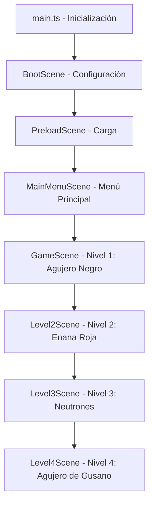

# Funcionamiento del Videojuego a Nivel de Código

Este documento explica de forma técnica y detallada cómo está estructurado el código de **"Misterio en el Agujero Negro"**, ideal para entender su arquitectura o explicarlo ante jueces.

---

## 1. Arquitectura General y Flujo de Datos

El juego utiliza una arquitectura basada en **Escenas (Scenes)** administradas por el motor **Phaser 3**. El flujo de ejecución es lineal a través de estas escenas:



---

## 2. El Punto de Entrada ([main.ts](file:///c:/Users/mika/Documents/videojuegoPeable/src/main.ts))

Este archivo inicializa la instancia de Phaser mediante un objeto de configuración (`Phaser.Types.Core.GameConfig`):

*   **Físicas (Physics):** Configura el motor de física `arcade` sin gravedad global (`gravity: { x: 0, y: 0 }`). Esto se hace porque la gravedad del juego no atrae los objetos "hacia abajo", sino radialmente hacia el agujero negro.
*   **Escalabilidad (Scale):** Usa el modo `Phaser.Scale.FIT` y `autoCenter` para que el lienzo (canvas) mantenga una proporción de 16:9 (1024x576 píxeles) y se ajuste a cualquier pantalla de forma automática.
*   **Registro de Escenas:** Declara la lista ordenada de clases de escena que Phaser gestionará.

---

## 3. Lógica de Escenas Clave

### A. Detección y Controles ([BootScene.ts](file:///c:/Users/mika/Documents/videojuegoPeable/src/scenes/BootScene.ts))
En su ciclo de vida `create()`, detecta el dispositivo del jugador:
*   Si es móvil, configura el registro interno con `virtual_buttons`.
*   Si es de escritorio, por defecto activa el teclado o ratón (`keyboard`/`pointer`).

### B. El Nivel del Agujero Negro ([GameScene.ts](file:///c:/Users/mika/Documents/videojuegoPeable/src/scenes/GameScene.ts))
Es el núcleo de la física de gravedad simulada. En el método **`update()`** (que corre a 60 FPS):
1.  **Fuerza de Atracción (Gravedad Radial):** 
    Calcula la distancia entre la nave y el centro del agujero negro usando la fórmula del teorema de Pitágoras:
    $$\text{distancia} = \sqrt{dx^2 + dy^2}$$
    Si la distancia es menor a 450 píxeles, aplica una aceleración vectorial hacia el centro:
    $$\text{aceleración} = \frac{\text{fuerza gravitatoria}}{\text{distancia}^2}$$
2.  **Horizonte de Sucesos (Colisión):**
    Si la nave se acerca a menos de 50 píxeles, entra en el "límite de no retorno", restando una vida y reiniciando la posición de la nave.
3.  **Recolección de Sondas:**
    Usa el sistema de colisiones de Phaser (`physics.add.overlap`) para detectar cuándo la nave toca un orbe amarillo (`data_orb`). Al hacerlo, se pausa la física y se lanza la trivia.

### C. El Nivel del Agujero de Gusano ([Level4Scene.ts](file:///c:/Users/mika/Documents/videojuegoPeable/src/scenes/Level4Scene.ts))
Cambia la mecánica de simulación por un **Runner vertical infinito**:
*   **Movimiento Restringido:** En el bucle de actualización, se fuerza la coordenada Y de la nave (`this.probe.y = height - 100`) y se desactiva la velocidad vertical, permitiendo únicamente el movimiento horizontal.
*   **Efecto de Velocidad:** Un conjunto de rectángulos (`speedLines`) caen de forma vertical continua y se reposicionan arriba al salir de la pantalla para simular movimiento hacia adelante.
*   **Generador de Anomalías (Spawning):** Un temporizador (`spawnTimer`) genera objetos `anomaly_tex` (círculos rojos) en coordenadas X aleatorias que caen a distintas velocidades físicas hacia abajo.

---

## 4. Persistencia de Datos ([StorageService.ts](file:///c:/Users/mika/Documents/videojuegoPeable/src/utils/StorageService.ts))

Este módulo utiliza la API nativa de JavaScript **`localStorage`** para que el navegador o la aplicación recuerden los datos del jugador entre sesiones:

```typescript
export class StorageService {
  private static PREFIX = 'blackhole_mystery_';
  // ...
  static setCurrentLevel(level: number): void {
    localStorage.setItem(this.PREFIX + 'current_level', level.toString());
  }
}
```

Al ganar un nivel o desbloquear una medalla, esta clase serializa la información en formato de texto y la guarda localmente, evitando la necesidad de un servidor de bases de datos.

---

## 5. El Entorno de Escritorio ([main.cjs](file:///c:/Users/mika/Documents/videojuegoPeable/electron/main.cjs))

Para convertir la aplicación web en un programa `.exe`, **Electron** actúa como un navegador web incrustado (basado en Chromium) enfocado en una sola página:

*   **`createWindow()`**: Instancia una ventana con `BrowserWindow` a la que se le pasa `resizable: true` para permitir maximizar y cambiar su tamaño.
*   **`win.loadFile`**: Carga el archivo HTML estático precompilado por Vite en `dist/index.html`.
